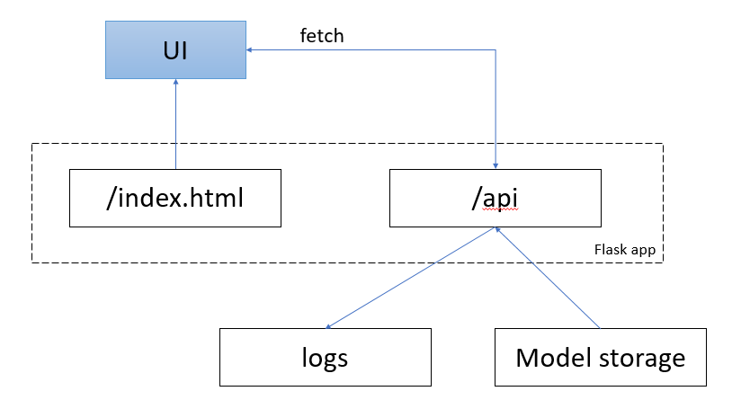

## Housing Price Prediction Model

### Описание проекта
Проект направлен на создание модели машинного обучения для прогнозирования цен на жилье. Модель использует различные характеристики объектов недвижимости для предсказания их рыночной стоимости.

### Структура проекта
```
housing_price_prediction/
├── data/
│   ├── raw/                # Исходные данные
│   ├── processed/          # Обработанные данные
├── models/                 # Обученные модели
├── notebooks/              # Jupyter notebooks
├── service/                # Сервис предсказания цены на недвижимость
│   ├── templates/          # Шаблоны для веб-приложения
│   └── app.py              # Flask приложение
├── src/                    # Исходный код
│   ├── parse_cian.py       # Сбор данных
│   └── pipeline.py         # Жизненный цикл модели
├── requirements.txt        # Требования к зависимостям
└── README.md
```

### Архитектура сервиса ПА


### Признаки
Используемые данные включают следующие характеристики:
* Площадь жилья
* Количество комнат
* Этаж
* Тип владельца объявления

### Модель машинного обучения
* **Random Forest** - ансамбль деревьев решений

### Данные

Собраны в период с 19.05.2025 по 19.05.2025
В выборке студии, 1, 2, 3, 4, 5 комнатные квартиры
Цена и метраж квартир ограничены 10% и 90% квантилем

### Результаты
После обучения модели достигаются следующие результаты:
* MAE: ~16425256.50 руб. 
* RMSE: ~31494253.82 руб.
* R² Score: ~0.6656

### Контакты
Для вопросов и предложений обращайтесь:
* Email: 241234@edu.fa.ru
